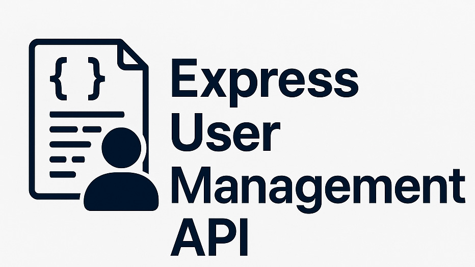

# 🔐 Express User Management API with JWT and logging - Scalable Example

A simple RESTful API for user management built with Express.js and MongoDB. Features user registration, login with JWT authentication, and CRUD operations for users. Includes request logging and authentication middleware.

> ⚠️ **Warning:** When using MongoDB Atlas, make sure to add your current IP address to the cluster's Network Access whitelist. Otherwise, your application will not be able to connect to the database. You can do this from the Atlas dashboard under Security → Network Access → Add IP Address.

## File Structure
```
express-api-example/
├── .env
├── .gitignore
├── assets/
│   └── jwt_logo.jpg
├── cmd.txt
├── index.js
├── package.json
├── package-lock.json
├── readme.md
├── logs/
│   └── api-logs.json
├── middlewares/
│   ├── authMiddleware.js
│   └── logger.js
├── models/
│   └── User.js
├── routes/
│   ├── auth.js
│   └── user.js
├── Postman/
│   └── 🔐User Management API.postman_collection.json
```

## Features
- User registration and login (JWT-based authentication)
- Protected routes for user management
- Request logging to JSON file
- MongoDB integration via Mongoose
- Environment variable support via `.env`

## Endpoints
- `POST /api/auth/register` — Register a new user
- `POST /api/auth/login` — Login and receive JWT token
- `GET /api/users` — List all users (protected)
- `GET /api/users/:id` — Get user by ID (protected)
- `PUT /api/users/:id` — Update user by ID (protected)
- `DELETE /api/users/:id` — Delete user by ID (protected)
- `GET /api/secret` — Example protected route

---

# Getting Started

## 1️⃣ Clone the Repository

```bash
git clone https://github.com/PUSKAR-DJ/express-api-example.git
cd express-api-example
```
---

## 2️⃣ Setup

### Install dependencies:

```bash
npm install
```

---

### 🔗 How to Get Your MongoDB URI

1. **Sign up or log in to [MongoDB Atlas](https://www.mongodb.com/cloud/atlas).**
2. **Create a new project and cluster** (use the free tier for testing).
3. **Add a database user** with a username and password.
4. **Go to your cluster dashboard and click 'Connect'.**
5. **Choose 'Connect your application'.**
6. **Copy the provided connection string.**
   - It will look like:
     ```
     mongodb+srv://<username>:<password>@cluster0.xxxxx.mongodb.net/?retryWrites=true&w=majority
     ```
7. **Replace `<username>` and `<password>` with your database user's credentials.**
8. **Paste this URI as the value for `MONGO_URI` in your `.env` file.**

---

## 3️⃣ Create a `.env` File

Add the following content to a new `.env` file in the root directory:

```env
MONGO_URI=your_mongodb_connection_string
JWT_SECRET=your_jwt_secret
PORT=3000
```
---

## 4️⃣ Start the Server - `index.js`

### Use node to start the server in the Terminal:

```bash
node .
```
OR

```bash
node index.js
```

---

## ✅ Testing All API Methods via Postman

1. **Import Postman Collection**
   - Open Postman and import the `Postman/🔐User Management API.postman_collection.json` file.
   - Use the collection to test all endpoints below.

2. **Register User**
   - **POST** `/api/auth/register`
   - **Body (JSON):**
     ```json
     {
       "name": "John",
       "email": "john@example.com",
       "password": "password123"
     }
     ```
   - **Response:** User created

3. **Login**
   - **POST** `/api/auth/login`
   - **Body (JSON):**
     ```json
     {
       "email": "john@example.com",
       "password": "password123"
     }
     ```
   - **Response:** Returns a JWT `token`

4. **Access Protected Route**
   - **GET** `/api/secret`
   - **Header:** `Authorization: Bearer <token>`
   - **Response:** Protected message

5. **Get All Users**
   - **GET** `/api/users`
   - **Header:** `Authorization: Bearer <token>`
   - **Response:** List of users

6. **Get One User**
   - **GET** `/api/users/{userId}`
   - **Header:** `Authorization: Bearer <token>`
   - **Response:** User details

7. **Update User**
   - **PUT** `/api/users/{userId}`
   - **Header:** `Authorization: Bearer <token>`
   - **Body (JSON):**
     ```json
     {
       "name": "John Updated",
       "email": "updated@example.com"
     }
     ```
   - **Response:** Updated user

8. **Delete User**
   - **DELETE** `/api/users/{userId}`
   - **Header:** `Authorization: Bearer <token>`
   - **Response:** User deleted

---

## Dependencies
- express
- mongoose
- jsonwebtoken
- bcryptjs
- uuid
- dotenv

## Logging
All API requests are logged to `logs/api-logs.json`.

---

